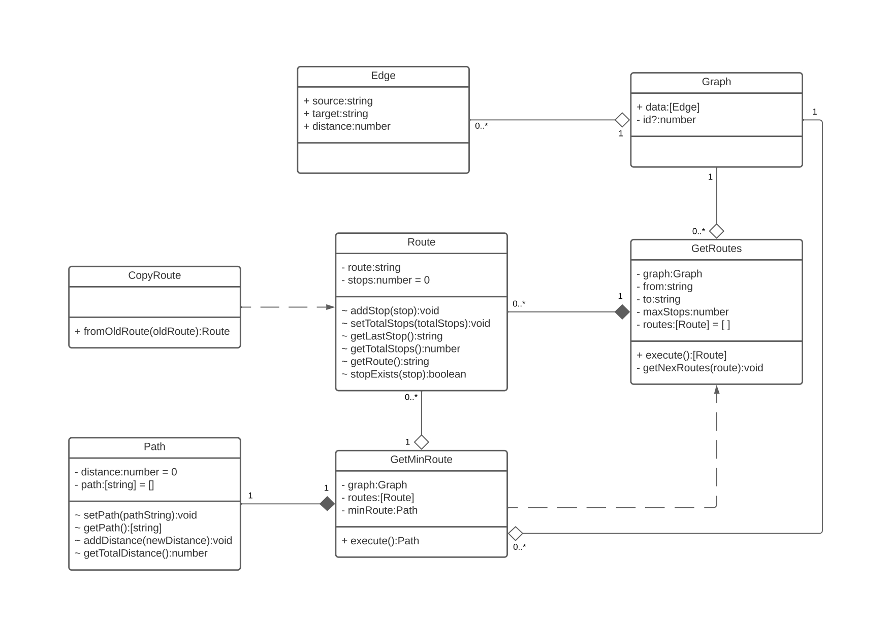
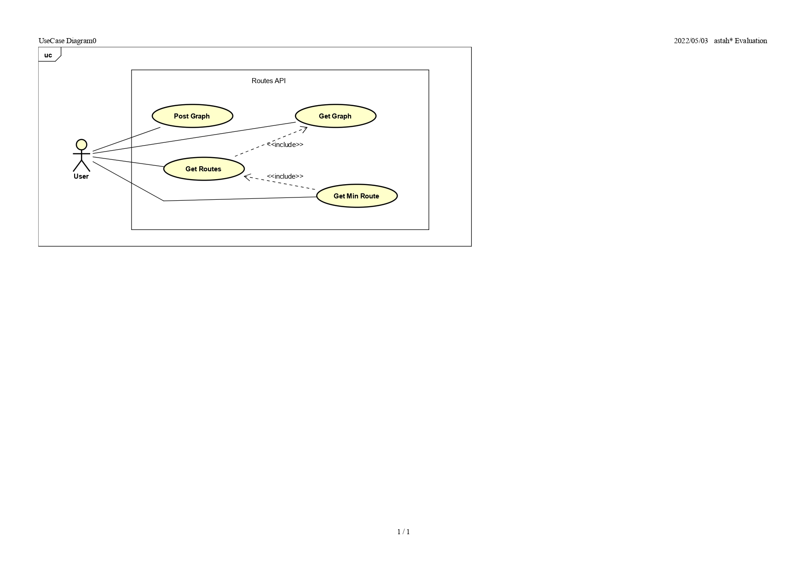

# Desafio Dev Jr/Pl

Dado o ([enunciado](./README-stat.md)), esta é a solução implementada por mim, **Vítor Mateus.**
Optei por desenvolver a API em TypeScript pelo prévio conhecimento na stack e produtividade que ela oferece.

## Modelagem OO

### Diagrama de classes


### Diagrama de casos de uso


## Execução

1. Clonar este repositório
```
git clone https://gitlab.com/vitor-msp/desafio-dev-jr-pl.git
```

2. Acessar a pasta baixada
```
cd desafio-dev-jr-pl
```

3. Executar o docker-compose

Obs.1: a porta 8080 da sua máquina deve estar liberada

```
docker-compose up -d
```

## Testes e Considerações

1. A documentação foi desenvolvida pelo [Swagger](https://swagger.io/) e se encontra disponível na rota [/api-docs](http://localhost:8080/api-docs/), onde a API poderá ser testada

2. Percebi que conteúdos json copiados do GitLab contêm *zero width space character*, o qual invalida o json no Node. A solução que encontrei foi filtrar esse caracter do json no lado cliente, e para isso é possível usar a página html disponível na rota [/json-beautify](http://localhost:8080/json-beautify)