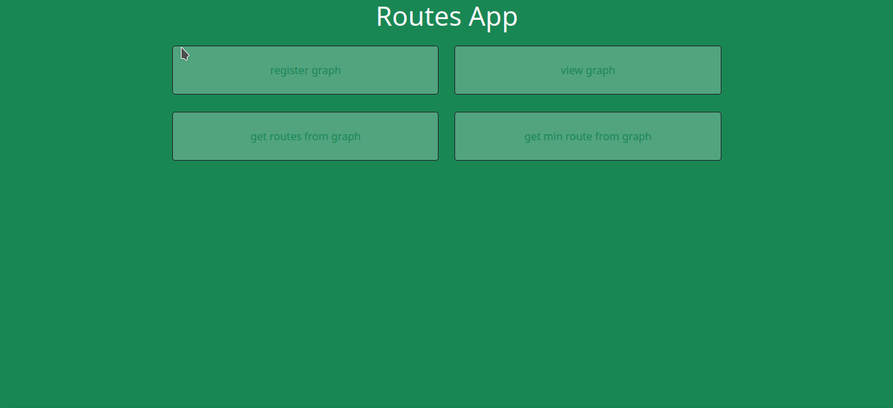

# Routes API

API para obtenção das melhores rotas para transporte em um mapa (grafo).
O enunciado deste desafio pode ser lido [aqui.](./README-stat.md)



- Acesse o frontend [aqui](https://github.com/vitor-msp/routes-app)

- Acesse a infraestrutura [aqui](https://github.com/vitor-msp/routes-infra)

## Execução

1. Clonar este repositório
```
git clone https://github.com/vitor-msp/routes-api.git
```

2. Acessar a pasta baixada
```
cd routes-api
```

3. Criar o arquivo .env e configurar a senha do MongoDB

```
cp .env.sample .env
```

4. Criar a chave de autenticação da replica set do MongoDB

```
sudo ./scripts/create-rs_keyfile.sh
```

5. Executar o docker-compose

Obs.1: a porta 8080 da sua máquina deve estar liberada

```
docker-compose up -d --build
```

6. Iniciar a replica set do MongoDB

```
./scripts/start-replica-set.sh

```

## Testes e Considerações

1. A documentação foi desenvolvida pelo [Swagger](https://swagger.io/) e se encontra disponível na rota [/api-docs](http://localhost:8080/api-docs/), onde a API poderá ser testada

2. Percebi que conteúdos json copiados do GitLab contêm *zero width space character*, o qual invalida o json no Node. A solução que encontrei foi filtrar esse caracter do json no lado cliente, e para isso é possível usar a página html disponível na rota [/json-beautify](http://localhost:8080/json-beautify)